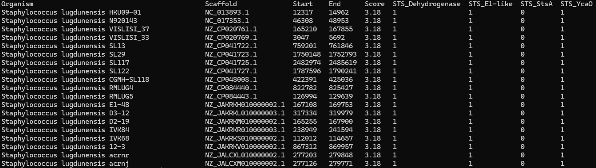

# What is this repo?
For the Integrated Bioinformatics Project (IBP), we have been assigned the task of solving an issue with another bioinformatics tool: [CAGECAT](https://cagecat.bioinformatics.nl/).
We have created our own tool, CAGECLEANER, for which this repository holds all necessary information.
To familiarize yourself with the project folder structure, open the INDEX.txt file.

# Problem definition
CompArative GEne Cluster Analysis Toolbox (CAGECAT) is an online web server used to find novel Biosynthetic Gene Clusters (BGCs). 
In the back, CAGECAT relies on [cblaster](https://github.com/gamcil/cblaster) and [clinker](https://github.com/gamcil/clinker), made by the same developers.

The current issue in this workflow is that the output consists of many duplicate hits (see figure below). 

 

When we provide a query (a set of genes of which we believe are clustered and involved in seondary metabolite production), cblaster uses
the NCBI API to BLAST these sequences and find similar ones. cblaster then uses the Identical Protein Group database to
fetch genomic coordinates for our genes of interest. If the genes are close enough to each other in the genome, they are considered as a hit. 

However, due to the many duplicate sequence and genome entries in the NCBI database, the output of cblaster quickly becomes flooded with hits 
essentially coming from the "same" genome. Hence, the output of this tool becomes difficult to interpret and use in further analysis. 
For example: the above figure contained roughly 800 strains of Staphylococcus aureus. Which one to choose for further analysis?

# Solution
Our solution consists of using a genome dereplication tool [skDER](https://github.com/raufs/skDER.git) to get rid of redundant hits. 
For each hit in the cblaster output, our tool fetches the corresponding genome assembly ID and downloads the genome.
Once all genomes are fetched, skDER dereplicates the genomes and selects representatives for each cluster. 
These representative genomes are then used to extract the 'cleaned' hits from the original cblaster output file.

CAGECLEANER could successfully reduce 1155 hits in the above example to 30 hits when using a 99.0% identity cutoff for dereplication, making it much easier to select candidates for further analysis.
The output of this cagecleaner run can be found in /data/example\_runs/cagecleaner/slurm-STS.out. The correpsonding issued command can be found in the cagecleaner.slurm file residing in the same folder.

TODO: import fig here.

# Usage
To use cagecleaner, do the following:
    1. Clone our repository and cd into it: `cd IBP/`
    2. Load the conda environment: `conda env create -n cagecleaner -f CONDA_ENV.yaml`
    3. Activate the conda environment: `conda activate cagecleaner`
    4. Go to the folder where the source code resides: `cd programs/cagecleaner/`
    5. Execute the 'main.py' file: `python3 main.py <path_to_binary> <path_to_summary> <percent identity cutoff>`
    6. The output will be written to 'IBP/data/output/'

# Limitations
Several things can be improved in our project:
    1. Fetching genome assembly IDs is currently the rate limiting factor. It takes about 5-10 seconds per scaffold ID. Parallelization of the queries could resolve this.
    2. Ideally, we would want the tool to be fully integrated into the cblaster workflow, such that it need not be used separately afterwards.
    3. There is no assessment of genome quality before dereplication. Tools such as checkM can remove contaminated or low quality genomes before dereplication.

